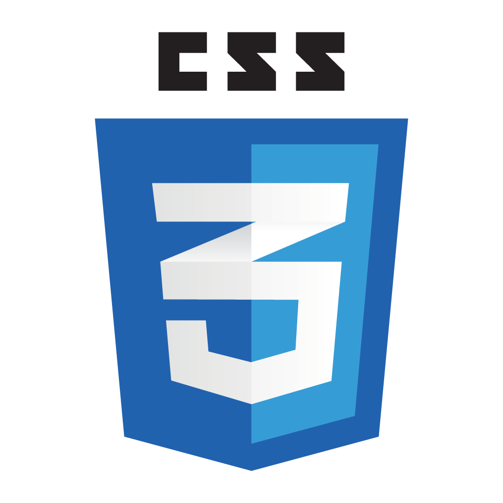
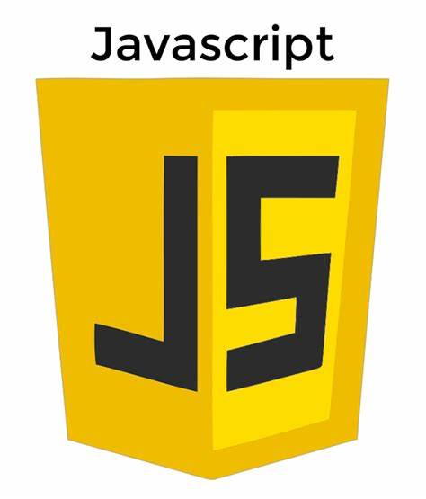
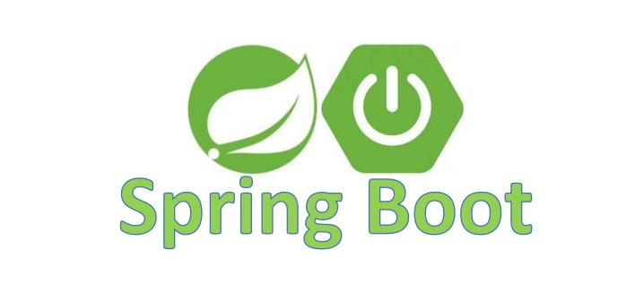
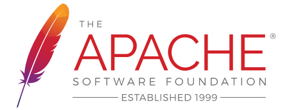
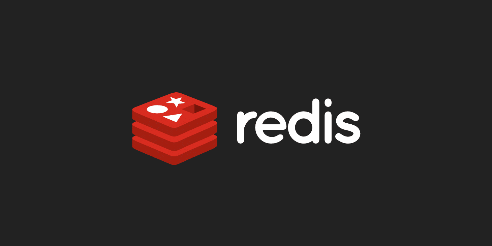

# Manage the back-end of the system

------

## 🚀学习spring boot 构建管理系统后端

> 链接为管理系统前端代码库
>
> ⚓https://github.com/Spicy-Rabbit-Head/Management-system-front-end

------

## 📚简介

本项目是为学习记录而生,记录了从零开始学习构建一个基于 Spring Boot + Vue3 的前后端分离项目.

该库为后端代码

## 🤓前端技术栈

    

        
     

    
------

## 🤔后端技术栈

    

 
 
   
     

------

## 🛠️后端模块

项目中保护的模块有:

| Management-System-Entry 模块 | 该项目的入口程序               |
|----------------------------|------------------------|
| Module-API 模块              | 包含该项目所有Controller控制层代码 |
| Module-Service 模块          | 包含该项目所有Service服务层代码    |
| Module-Dao 模块              | 包含该项目所有Dao持久层代码        |
| Module-Entity 模块           | 包含该项目所有实体类             |
| Module-ResultCode 模块       | 包含该项目所有的结果码            |
| Module-Utils 模块            | 包含该项目所有的工具类            |
| Module-Config 模块           | 包含该项目所有的配置类            |
| Module-Security 模块         | 包含该项目所有的安全权限控制服务类      |

